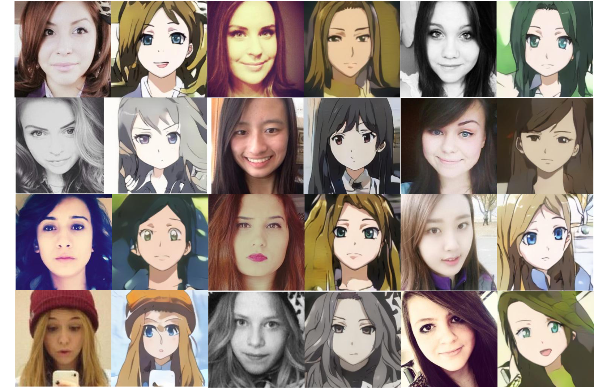
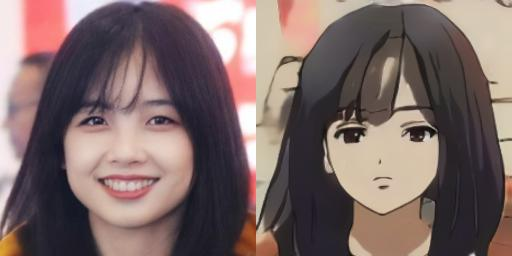
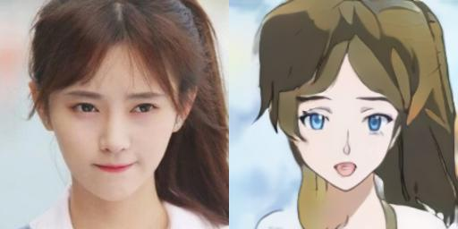

# Morph-UGATIT
a morph transfer UGATIT for image translation.






# Introduction
[中文技术文档](https://zhuanlan.zhihu.com/p/348124048)

This is Pytorch implementation of UGATIT, paper "U-GAT-IT: Unsupervised Generative Attentional Networks with Adaptive Layer-Instance Normalization for Image-to-Image Translation".

Additionally, I DIY the model by adding two modules, a MLP module to learn a latent zone and an identity preserving loss. These two factors make UGATIT to achieve a progressive domain transfer for image translation. I call this method Morph UGATIT.

My work has two aspects:
* Firstly, according to official TensorFlow code of UGATIT, I use PyTorch to reimplement it, very close to original TF model including network, training hyper parameters.
* I add a MLP module, introducing a latent code for generator. And an identity preserving loss is used to learn more common feature for different domains.

I train model on two datasets, "adult2child" and "selfie2anime".

# Requirements
* python3.7
* Pytorch >= 1.6
* dlib. Before installing dlib, you should install Cmake and Boost
```
pip install Cmake
pip install Boost
pip install dlib
```
* other common-used libraries.

# How to Use
There are many models in my repo, but you just need two models and corresponding python script files.
* UGATIT: "configs/cfgs_ugatit.py", "models/ugatit.py", "tool/train_ugatit.py", "tool/demo_ugatit.py"
* Morph UGATIT: "configs/cfgs_s_ugatit_plus.py", "models/s_ugatit_plus.py", "tool/train_s_ugatit_plus.py", "tool/demo_morph_ugatit.py"

### train step
1. getting dataset. The "adult2child" dataset comes from G-Lab, which is generated by StyleGAN. You can download [here](http://www.seeprettyface.com/mydataset.html)


The "selfie2anime" dataset comes from official UGATIT repo. 

2. set configurations. configuration files can be found "configs" dir. You just focus on "cfgs_ugatit.py" and "cfgs_s_ugatit_plus.py". Please change:
* dirA: domain A dataset path.
* dirB: domain B dataset path.
* anime: whether dataset is "selfie2anime".
* tensorboard: tensorboard log path.
* saved_dir: save model weight into "saved_dir".

3. start to train.
```
cd tool
python train_ugatit.py   # ugatit
python train_s_ugatit_plus.py   #  morph ugatit
```
you can also use tensorboard to check loss curves and some visualizations.

### evaluation step
Since dlib is necessary, you should download dlib model weight [here](https://drive.google.com/file/d/1gyv5lU0xVafqAB2cIxqycLY1Wi-Lf5O3/view?usp=sharing).
change "alignment_loc" at "tool/demo_xxxx.py". "xxx" means "ugatit" or "morph_ugatit" to your dlib model weight path.
Then put a test image into a dir.

```
cd tool
python demo_ugatit.py --type ugatit --resume ${ckpt path}$ --input ${image dir}$ --saved-dir ${result location}$ --align
python demo_morph_ugatit.py --resume ${ckpt path}$ --input ${image dir}$ --saved-dir ${result location}$ --align
```

Note: if you want to try "selfie2anime", please add a extra term "--anime".

Here I provide my pretrained model weights.

for "adult2child" dataset

[ugatit](https://drive.google.com/file/d/1L_VOmmHHw4ZikfSkQDcuQMwsWO0ntmFo/view?usp=sharing)

[morph ugatit](https://drive.google.com/file/d/1vfeY-35DTKgBvh_zNQ1tGBtGCp6SFv8L/view?usp=sharing)

for "selfie2anime" dataset

[ugatit](https://drive.google.com/file/d/1QmvS9DQrtWMQrlu1YtjEpGLeQcvhxkbf/view?usp=sharing)

More results can be seen [here](https://zhuanlan.zhihu.com/p/348124048)

# References
* official UGATIT repo
* official CycleGAN repo
* GLab, http://www.seeprettyface.com/
* paper "Lifespan age transformation synthesis" and its' official code.
